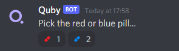
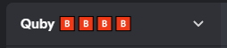
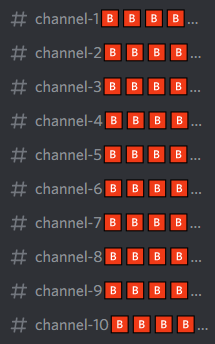

# Quby Bot

A configurable <u>Discord Community</u> server nuking bot with a small twist.

The bot will perform these actions in the following order:

1. When the bot is added to a server, it will find a channel named "general". If it can't it will use the servers system channel. If it can't find that then it will create a new channel.
2. It will create a new message that looks like the following:

	

3. When any user reacts to either emoji, the bot will look for a stage channel. If it can't find one it will create a new one.
4. The bot will start a new stage instance (name can be configured in `config.json`). It will automatically join it and make itself a speaker.
5. The bot will immediately begin to play a TTS generated countdown.
6. Once the countdown is finished, it will begin to play Bangarang by Skrillex. On the drop (26 seconds in), it will begin the nuke.
7. The server name will have the emoji, 🅱, added to it.

	

8. For every channel in the server, the emoji, 🅱, will be added to it. A specified number of messages will also be spammed. (Excludes the pill message's channel)

	

9. After 48 seconds, if `guiltMessage` in config isn't blank, the bot will then send its contents in the pill message's channel.

## Undoing the nuke

`!undo` will revert the channel and server renames (due to ratelimits, this may not work 100% of the time).
The bot will also attempt to delete all spammed messages. However, depending on how many messages were spammed, this may not work 100% of the time. A bot such as Dyno can be used to purge all the messages. For example;

```
?purge user @Quby#1234 1000000
```

## Installation

1. Clone this git repo and install packages (`npm i`).
2. Rename `config.example.json` to `config.json`.
3. Create a Discord application and bot. Insert the bot's token into `token` in `config.json`.
4. Create your own server (make it a community one if testing) and invite the bot to it.
5. Upload all the emojis from the `/emojis` folder to the server and set their IDs in `config.json`. 
6. You can configure other settings by referring below.
7. You are ready to nuke! Make sure the server is a community so it can create a stage. Invite the bot with **administrator permissions**.

## Configuration

In the main repository, there is a `config.json` file. The config file is already filled with some parameters which can be changed.

### messagesInEachChannel

This specifies how many messages the bot spams

### stageName

The name of the stage instance the bot starts

### deleteWelcomeMessage

Specify whether to delete messages that welcome the bot

### guiltMessage

A message with these contents will be sent after 48 seconds

### nukeDumpChannel

A Discord channel that the bot has access to. If this isn't blank, the bot will fetch **all the messages** in the channel and put them in `payloads`.

### payloads

This is an array that contains messages the bot will spam.

Add `|*rand` at the end to specify you want the bot to repeat the contents a random amount of times.

```json
"payloads": [
	"a message to spam",
	"<:anEmojiToSpam:123456789>|*rand"
]
```

### emojis

Put the red and blue pill emoji IDs in here. For example, `<:redpill:1234567890>`.

### token

Put your bot's token in here
